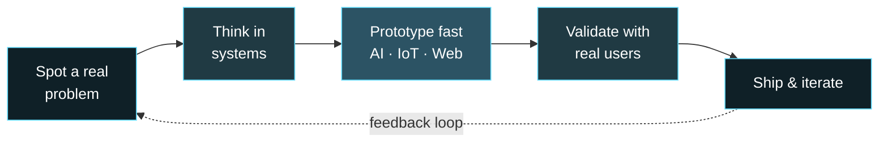
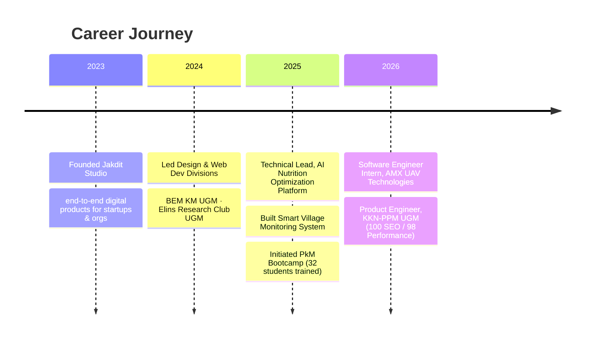

<div align="center">


# Dzaky Radithya Abimanyu

**Product Engineer · Founder of Jakdit Studio**

<a href="https://dzakyradithyaa.vercel.app">

</a>

</div>

<br/>

> *"Technology means nothing until it solves a problem for someone who needed it."*
> — the principle behind everything I build.

<br/>

##  Skill Focus

<div align="center">


<sub>Where I spend most of my energy — self-rated, always evolving.</sub>

</div>

<br/>

###  How I Think



<br/>

##  What I'm Building Right Now

<div align="center">

|  | Focus |
|---|---|
| **Jakdit Studio** | Running end-to-end product development for startups & organizations |
| **AI-driven products** | Exploring AI reasoning + optimization for real-world decision systems |
| **IoT for good** | Connecting hardware and software for agriculture, health & community impact |

</div>

<br/>

##  My Path So Far



<br/>

##  Tech Radar

<div align="center">

**Product & Frontend**
<br/>


**Backend & AI**
<br/>


**IoT, Cloud & Web3**
<br/>


**Design**
<br/>


</div>

<br/>

##  Selected Work

<table>
<tr>
<td width="33%" valign="top">

** Pagergunung Village Site**
<br/>
AI-powered public services platform.
<br/>
`100 SEO` `98 Performance`

</td>
<td width="33%" valign="top">

** AI Nutrition Optimizer**
<br/>
AI reasoning + linear programming for national-scale meal planning.
<br/>
`Python` `AI Reasoning`

</td>
<td width="33%" valign="top">

** Smart Village Monitor**
<br/>
Real-time env. dashboard from ESP32 sensors.
<br/>
`React` `FastAPI` `MQTT`

</td>
</tr>
<tr>
<td width="33%" valign="top">

** Bhumi Kalapa Ecosystem**
<br/>
Full brand system + web + catalog for local MSMEs.
<br/>
`Branding` `Next.js`

</td>
<td width="33%" valign="top">

** Colorimeter Platform**
<br/>
RGB sensor visualization + 3D-printed enclosure for lab research.
<br/>
`React` `Blender`

</td>
<td width="33%" valign="top">

** NFT Staking Fix**
<br/>
Diagnosed & restored Web3 wallet + smart contract integration.
<br/>
`Solidity` `Web3`

</td>
</tr>
</table>

<div align="center">

 Full case studies on my [**portfolio →**](https://dzakyradithyaa.vercel.app)

</div>

<br/>

##  Contribution Snake

<div align="center">


<sub>Auto-updates daily — the snake literally eats my contribution graph.</sub>

</div>

<br/>

<details align="center">
<summary> Psst — click here for a surprise</summary>
<br/>

```
$ whoami
> a product engineer who thinks in systems and ships in weeks, not months

$ cat ./philosophy.txt
> AI is only as good as the problem it's aimed at.

$ sudo make coffee
> permission granted. brewing...
```

</details>

<br/>

##  GitHub Activity

<div align="center">


</div>

<br/>

##  Certifications & Recognition

<div align="center">

| Certification | Issuer |
|---|---|
| Azure AI Fundamentals (AI-900) Prep | Microsoft |
| Code Generation & Optimization w/ IBM Granite | IBM × Hacktiv8 |
| Intro to Software Engineering | RevoU |
| The Field Guide to Human-Centered Design | — |

 Best Staff of the Month ·  Featured in *Kedaulatan Rakyat* — Digital Literacy & IoT Program

</div>

<br/>

##  Let's Build Something

<div align="center">

<a href="https://www.linkedin.com/in/dzakyradithyaa">

</a>
<a href="https://dzakyradithyaa.vercel.app">

</a>
<a href="mailto:radithyadzaky040505@gmail.com">

</a>

<br/><br/>


</div>
